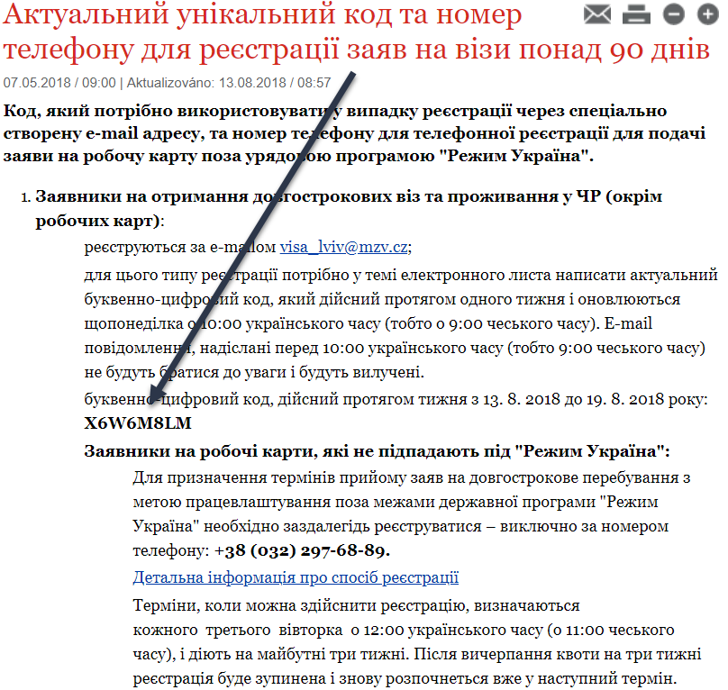
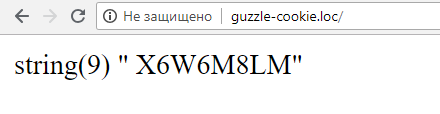

<div align="center">
<h1>Example of using Guzzle client with cookie</h1>
</div>

[](https://github.styleci.io/repos/151001672)

<hr/>


This example is written for educational purposes in order to show how to work with cookies with Guzzle client.

The  [site](https://www.mzv.cz/lvov/uk/x2004_02_03/x2016_05_18/x2017_11_24_1.html) is selected and  from it we will parse the code for registration.



But when requesting the site, we will come across a problem that the site does not return content, but will return the js code with function which set cookies. 
```
<html>
<body onload="antidos()">
<script>
function antidos() { document.cookie="EWAAD=1c3580445beef1431db8353bd406009c; 
path=/";document.location.href="https://www.mzv.cz/lvov/uk/x2004_02_03/x2016_05_18/x2017_11_24_1.html";}
</script>
<div align="center">
<noscript>EWA CDN (D)DoS protection. 
Please, enable javascript and cookies to continue.</noscript></div>
</body>
</html>
```

We will have such an algorithm for actions:
1. Request to receive js content
2. Parsing js content
3. Setting up cookies for Guzzle client
4. Request for page content
5. Content parsing and the getting of the registration code

## Installation

This is simple php application and for install run:

```
composer install
```

## Usage

When you have installed the package dependencies with composer you may open application in browser.

## Result



## LICENSE

This project is licensed under the MIT License - see the [LICENSE](LICENSE) file for details
